# Invoice Parsing System - Workflow Diagram

## Complete System Architecture & Workflow

```mermaid
graph TB
    Start([User Starts Application]) --> Frontend[Next.js Frontend<br/>localhost:3000]
    
    Frontend --> Upload{User Action}
    
    Upload -->|Upload File| FileSelect[File Selection<br/>PDF/PNG/JPG/JPEG]
    Upload -->|View Database| DatabaseView[View Saved Invoices]
    
    FileSelect --> FileType{File Type?}
    
    FileType -->|PDF| PDFProcess[PDF Processing]
    FileType -->|Image| ImageProcess[Image Processing]
    
    PDFProcess --> PDFInfo[Get PDF Info<br/>/api/pdf-info<br/>Extract Page Count]
    PDFInfo --> PageSelect[User Selects Page<br/>if multi-page]
    PageSelect --> ExtractBtn[Click Extract Button]
    
    ImageProcess --> ExtractBtn
    
    ExtractBtn --> ProgressUI[Show Progress Steps<br/>1. Upload Received<br/>2. Text Extracted<br/>3. AI Processing<br/>4. Normalizing<br/>5. Validated<br/>6. Complete]
    
    ProgressUI --> BackendAPI[Flask Backend API<br/>localhost:5000<br/>/api/extract]
    
    BackendAPI --> FileValidation{Validate File}
    FileValidation -->|Invalid| Error1[Return Error 400]
    FileValidation -->|Valid| ProcessFile[Process File Upload]
    
    ProcessFile --> FileTypeCheck{File Type?}
    
    FileTypeCheck -->|PDF| PDFConvert[Convert PDF Page to Image<br/>pdf2image + PIL<br/>DPI: 300 → JPEG]
    FileTypeCheck -->|Image| ImageConvert[Convert Image to RGB JPEG<br/>PIL Image Processing]
    
    PDFConvert --> ImageBytes[Image Bytes<br/>JPEG Format]
    ImageConvert --> ImageBytes
    
    ImageBytes --> ImageValidation[Validate Image<br/>Check JPEG Magic Bytes<br/>Verify Size]
    ImageValidation -->|Invalid| Error2[Return Error 400]
    ImageValidation -->|Valid| Base64Encode[Base64 Encode Image<br/>data:image/jpeg;base64,...]
    
    Base64Encode --> GroqClient1[Groq Client<br/>extract_raw_text]
    GroqClient1 --> GroqAPI1[Groq API<br/>LLaMA 4 Scout<br/>OCR Text Extraction]
    
    GroqAPI1 --> RawOCR[Raw OCR Text]
    
    RawOCR --> GroqClient2[Groq Client<br/>extract_invoice_data]
    GroqClient2 --> GroqAPI2[Groq API<br/>LLaMA 4 Scout<br/>Structured Data Extraction]
    
    GroqAPI2 --> JSONResponse[Raw JSON Response]
    
    JSONResponse --> PydanticValidate[Pydantic Validation<br/>InvoiceData Model]
    PydanticValidate -->|Invalid| Error3[Return Error 500]
    PydanticValidate -->|Valid| StructuredData[Structured Invoice Data]
    
    StructuredData --> Response[Return JSON Response<br/>- data: InvoiceData<br/>- raw_ocr_text<br/>- raw_json_response]
    
    Response --> FrontendDisplay[Frontend Displays Results]
    
    FrontendDisplay --> BeforeAfter[Before/After Comparison View]
    
    BeforeAfter --> BeforeSection[Before Extraction<br/>- Raw OCR Text<br/>- Raw JSON Response]
    BeforeAfter --> AfterSection[After Extraction<br/>- SalesOrderHeader<br/>- SalesOrderDetail<br/>Editable Fields]
    
    AfterSection --> UserEdit{User Edits Data?}
    UserEdit -->|Yes| EditFields[Edit Invoice Fields]
    UserEdit -->|No| SaveBtn[Click Save Button]
    EditFields --> SaveBtn
    
    SaveBtn --> SaveAPI[Flask Backend API<br/>/api/save-invoice]
    
    SaveAPI --> SanitizeData[Sanitize Data<br/>Remove NaN/Infinity<br/>Convert to null]
    SanitizeData --> ExcelDB[Excel Database Handler<br/>excel_handler.py]
    
    ExcelDB --> ExcelFile[invoice_database.xlsx<br/>SalesOrderHeader Sheet<br/>SalesOrderDetail Sheet]
    
    ExcelFile --> SaveSuccess[Save Success<br/>Return OrderID]
    
    SaveSuccess --> SuccessAlert[Show Success Toast<br/>Top-right Notification<br/>Auto-dismiss 5s]
    
    SuccessAlert --> RefreshDB[Refresh Database View]
    RefreshDB --> DatabaseView
    
    DatabaseView --> ExcelFile
    
    Error1 --> FrontendError[Display Error Message]
    Error2 --> FrontendError
    Error3 --> FrontendError
    
    FrontendError --> Start
    
    style Start fill:#e1f5ff
    style Frontend fill:#4a90e2,color:#fff
    style BackendAPI fill:#50c878,color:#fff
    style GroqAPI1 fill:#ff6b6b,color:#fff
    style GroqAPI2 fill:#ff6b6b,color:#fff
    style ExcelFile fill:#ffa500,color:#fff
    style SuccessAlert fill:#32cd32,color:#fff
    style Error1 fill:#ff4444,color:#fff
    style Error2 fill:#ff4444,color:#fff
    style Error3 fill:#ff4444,color:#fff
```



## Detailed Component Flow

### 1. Frontend Components (Next.js)
```
User Interface
├── Upload Section
│   ├── File Input (PDF/Images)
│   ├── Page Selector (for PDFs)
│   └── Extract Button
├── Progress Indicator
│   ├── Step 1: Upload Received
│   ├── Step 2: Text Extracted
│   ├── Step 3: AI Processing
│   ├── Step 4: Normalizing
│   ├── Step 5: Validated
│   └── Step 6: Complete
├── Results Display
│   ├── Before Extraction
│   │   ├── Raw OCR Text
│   │   └── Raw JSON Response
│   └── After Extraction
│       ├── SalesOrderHeader (Editable)
│       └── SalesOrderDetail (Editable)
└── Database View
    └── Saved Invoices Table
```

### 2. Backend API Endpoints (Flask)
```
/api/health
├── Health Check
└── API Key Status

/api/pdf-info
├── POST: PDF File
├── Extract Page Count
└── Return: {success, total_pages}

/api/extract
├── POST: File Upload
├── Process File
│   ├── PDF → Image Conversion
│   ├── Image → JPEG Conversion
│   └── Base64 Encoding
├── Call Groq API
│   ├── OCR Text Extraction
│   └── Structured Data Extraction
└── Return: {success, data, raw_ocr_text, raw_json_response}

/api/save-invoice
├── POST: Invoice Data
├── Sanitize Data
├── Save to Excel
└── Return: {success, order_id}

/api/get-invoices
├── GET: All Invoices
└── Return: Invoice List

/api/get-invoice/<order_id>
├── GET: Single Invoice
└── Return: Invoice Data
```

### 3. Data Processing Pipeline
```
File Upload
    ↓
File Type Detection
    ↓
┌─────────────────┬─────────────────┐
│   PDF File      │   Image File     │
│                 │                  │
│ PDF → Image     │ Image Processing │
│ (pdf2image)     │ (PIL)           │
│                 │                  │
│ Page Selection  │ Format Check     │
│ DPI: 300        │ Mode Conversion  │
└────────┬─────────┴────────┬─────────┘
         │                  │
         └────────┬─────────┘
                  ↓
         JPEG Format Conversion
                  ↓
         RGB Mode + Size Validation
                  ↓
         Base64 Encoding
                  ↓
         Groq API Request
```

### 4. Groq API Integration
```
Groq Client (utils.py)
    ↓
┌─────────────────────────────┐
│   Step 1: OCR Extraction    │
│   Model: LLaMA 4 Scout      │
│   Prompt: Extract raw text   │
│   Output: Raw OCR Text      │
└──────────────┬──────────────┘
               ↓
┌─────────────────────────────┐
│   Step 2: Data Extraction   │
│   Model: LLaMA 4 Scout      │
│   Prompt: Structured JSON   │
│   Schema: InvoiceData       │
│   Output: JSON Response     │
└──────────────┬──────────────┘
               ↓
         Pydantic Validation
               ↓
      Structured Invoice Data
```

### 5. Excel Database Structure
```
invoice_database.xlsx
├── SalesOrderHeader Sheet
│   ├── OrderID (Primary Key)
│   ├── InvoiceNumber
│   ├── InvoiceDate
│   ├── DueDate
│   ├── CustomerName
│   ├── VendorName
│   ├── Currency
│   ├── Subtotal
│   ├── Tax
│   ├── TotalAmount
│   ├── BillingAddress
│   └── ShippingAddress
└── SalesOrderDetail Sheet
    ├── OrderID (Foreign Key)
    ├── LineNumber
    ├── Description
    ├── Quantity
    ├── UnitPrice
    └── TotalPrice
```

## Technology Stack

### Frontend
- **Framework**: Next.js 14+ (React)
- **Styling**: TailwindCSS
- **Language**: TypeScript
- **Features**: 
  - Real-time progress tracking
  - Step-by-step UI
  - Toast notifications
  - Responsive design

### Backend
- **Framework**: Flask
- **Language**: Python 3.12+
- **Key Libraries**:
  - `groq`: Groq API client
  - `pydantic`: Data validation
  - `pypdf`: PDF reading
  - `pdf2image`: PDF to image conversion
  - `PIL/Pillow`: Image processing
  - `pandas`: Excel operations
  - `openpyxl`: Excel file handling
  - `flask-cors`: CORS support

### External Services
- **Groq API**: LLaMA 4 Scout model for OCR and data extraction
- **Model**: `meta-llama/llama-4-scout-17b-16e-instruct`

## Error Handling Flow

```
Error Occurrence
    ↓
Error Type Detection
    ↓
┌──────────┬──────────┬──────────┐
│ 400      │ 500      │ Network  │
│ Bad      │ Server   │ Error    │
│ Request  │ Error    │          │
└────┬─────┴────┬─────┴────┬─────┘
     │          │          │
     ↓          ↓          ↓
Frontend    Frontend    Frontend
Error       Error       Error
Display     Display     Display
     │          │          │
     └──────────┴──────────┘
              ↓
      User Can Retry
```

## Data Flow Summary

1. **Upload**: User uploads PDF/image → Frontend
2. **Processing**: Frontend → Backend API → File Processing
3. **Conversion**: PDF/Image → JPEG format
4. **Extraction**: Backend → Groq API → OCR + Structured Data
5. **Validation**: Pydantic model validation
6. **Display**: Backend → Frontend → Before/After view
7. **Editing**: User edits data in Frontend
8. **Saving**: Frontend → Backend → Excel Database
9. **Confirmation**: Success toast notification

## Key Features

✅ **Multi-format Support**: PDF, PNG, JPG, JPEG  
✅ **Multi-page PDF**: Page selection support  
✅ **Real-time Progress**: Step-by-step progress indicator  
✅ **Before/After View**: Raw data vs Structured data  
✅ **Editable Fields**: User can edit extracted data  
✅ **Excel Integration**: Save to Excel database  
✅ **Multilingual**: Supports multiple languages via LLaMA 4  
✅ **Error Handling**: Comprehensive error messages  
✅ **Success Notifications**: Toast alerts for saved invoices
